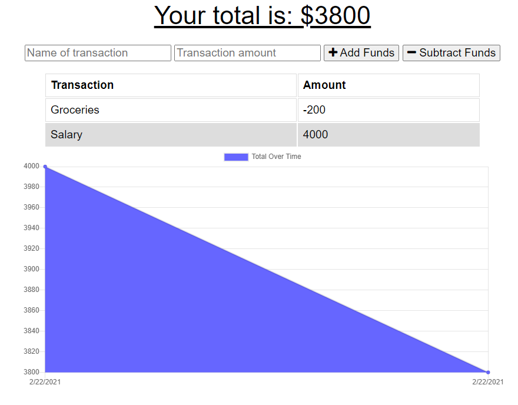
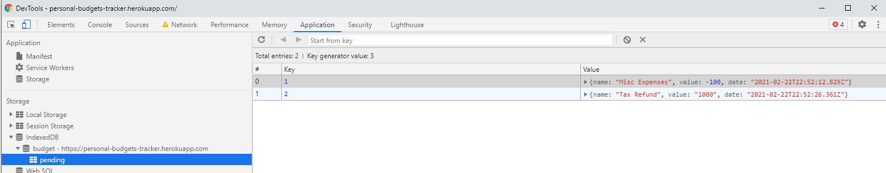
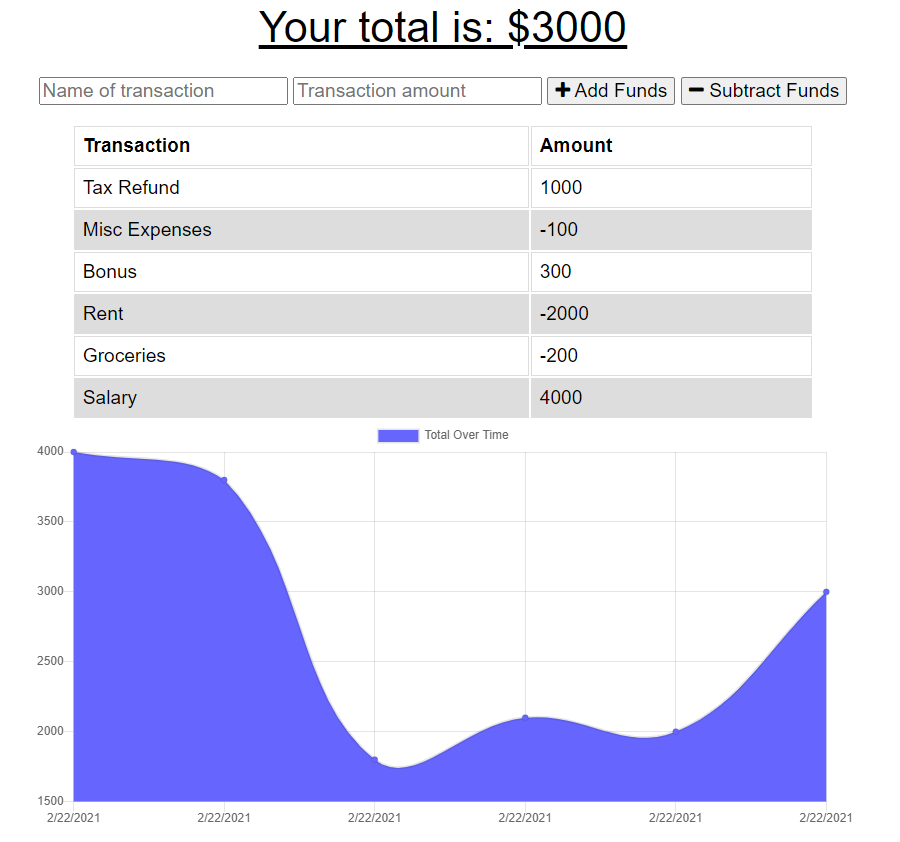
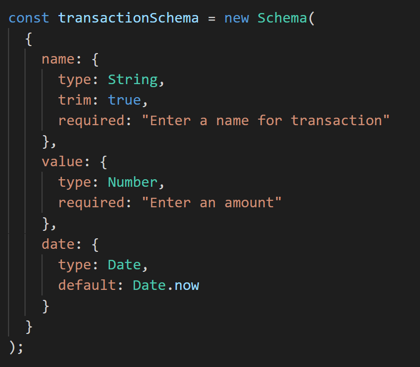

# Budget Tracker App

## Table of Contents

* [About the Project](#about-the-project)
* [Technology](#Technology)
* [Installation](#installation)
* [Database_Schema](#database-schema)
* [Roadmap](#roadmap)
* [Contributing](#contributing)
* [Deployment](#Deployment)
* [Contact](#contact)
* [LinkedIn](#LinkedIn)

## About the Project:
The app allows users to track their budget and makes the app available even if there are connectivity issues. App utilizes IndexedDB to keep track of transactions when the user is offline and updates the backend Database when user is online.

### Technology:
This app is build with [Node.js](https://nodejs.org/en/), [IndexedDB](https://developer.mozilla.org/en-US/docs/Web/API/IndexedDB_API) and [Mongoose](https://www.npmjs.com/package/mongoose) and deployed on Heroku (using Mongo Atlas).

## Database Schema

### Installation:
Clone the Repository and run 'npm i' to install all dependencies.

## Roadmap:
Currently no known issues, but track [open issues](https://github.com/garimaggupta/Budget_Tracker/issues) for proposed features (and known issues) in the future.  
  
## Contributing:

1. Fork the Project
2. Create your Feature Branch (`git checkout -b feature/AmazingFeature`)
3. Commit your Changes (`git commit -m 'Add some AmazingFeature'`)
4. Push to the Branch (`git push origin feature/AmazingFeature`)
5. Open a Pull Request

## Deployment:
This App is deployed on Heroku. Click here for the [link](https://personal-budgets-tracker.herokuapp.com/) of the deployed application.

## Contact:
garimaggupta@gmail.com

## LinkedIn:
[https://www.linkedin.com/in/garima-gupta-b3464b2/](https://www.linkedin.com/in/garima-gupta-b3464b2/)
